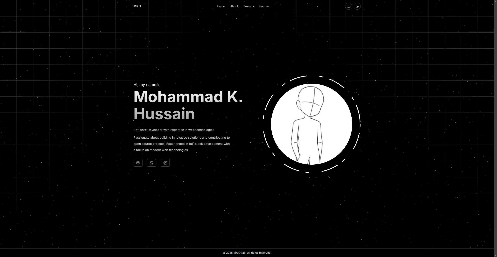

# MAX-786's Personal Website

<a href="https://mkhismkh.com" target="_blank" > </a>

This is the source code for my personal website, built using [Astro](https://astro.build/). Visit the live site at [mkhismkh.com](https://mkhismkh.com).

## Features

- **Portfolio Showcase** - Display projects, skills, and experience in a clean, modern interface
- **Digital Garden** - A knowledge management system for sharing ideas, solutions, and learnings
  - Tree/Leaf structure for organizing content
  - Growth stages to indicate content maturity
- **Authentication** - Secure admin access for content management using Clerk
- **Database Integration** - Content stored in Supabase
- **Responsive Design** - Works seamlessly on all devices
- **Dark/Light Mode** - Automatic theme switching based on user preference
- **Interactive UI** - Animations and particle effects

## Stack

This project uses the following technologies:

- [Astro](https://astro.build/) - The web framework for content-driven websites
- [React](https://react.dev/) - For interactive UI components
- [Tailwind CSS](https://tailwindcss.com/) - Utility-first CSS framework
- [TypeScript](https://www.typescriptlang.org/) - Type-safe JavaScript
- [Supabase](https://supabase.com/) - Open source Firebase alternative
- [Clerk](https://clerk.com/) - Authentication and user management

## Developer Setup

### Prerequisites

- [Node.js](https://nodejs.org/) (v18 or higher)
- [pnpm](https://pnpm.io/) (recommended) or npm/yarn
- [Git](https://git-scm.com/)

### Getting Started

1. Clone the repository:

   ```bash
   git clone https://github.com/MAX-786/mkhismkh.git
   cd mkhismkh
   ```

2. Install dependencies:

   ```bash
   pnpm install
   ```

3. Set up environment variables:
   Create a `.env` file in the root directory with the following variables:

   ```
   # Supabase
   SUPABASE_URL=your_supabase_url
   SUPABASE_KEY=your_supabase_anon_key

   # Clerk
   PUBLIC_CLERK_PUBLISHABLE_KEY=your_clerk_publishable_key
   CLERK_SECRET_KEY=your_clerk_secret_key
   ADMIN_USER_IDs=comma_separated_admin_user_ids
   ```

4. Start the development server:
   ```bash
   pnpm dev
   ```

### Supabase Setup

1. Create a new Supabase project at [supabase.com](https://supabase.com)
2. Set up the following tables:
   - `trees` - For garden tree structure
   - `leaves` - For garden leaf content
   - `leaf_references` - For references between leaves
   - `growth_stages` - For metadata about content maturity
3. Copy your project URL and anon key to the `.env` file

### Clerk Setup

1. Create a new Clerk application at [clerk.com](https://clerk.com)
2. Configure authentication methods (email, social logins, etc.)
3. Copy your publishable key and secret key to the `.env` file
4. Add admin user IDs to the `ADMIN_USER_IDs` environment variable

### Deployment

This project is configured for deployment on Vercel:

1. Push your code to GitHub
2. Connect your repository to Vercel
3. Configure environment variables in the Vercel dashboard
4. Deploy!

## 🧞 Commands

All commands are run from the root of the project, from a terminal:

| Command                | Action                                           |
| :--------------------- | :----------------------------------------------- |
| `pnpm install`         | Installs dependencies                            |
| `pnpm dev`             | Starts local dev server at `localhost:4321`      |
| `pnpm build`           | Build your production site to `./dist/`          |
| `pnpm preview`         | Preview your build locally, before deploying     |
| `pnpm astro ...`       | Run CLI commands like `astro add`, `astro check` |
| `pnpm astro -- --help` | Get help using the Astro CLI                     |
| `pnpm format`          | Format code with Prettier                        |

## Update CHANGELOG

### Types of changes

- `Added` for new features.
- `Changed` for changes in existing functionality.
- `Deprecated` for soon-to-be removed features.
- `Removed` for now removed features.
- `Fixed` for any bug fixes.
- `Security` in case of vulnerabilities.

## License

MIT License - Feel free to use this code as inspiration for your own projects!
